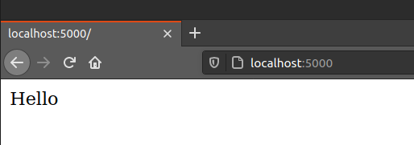
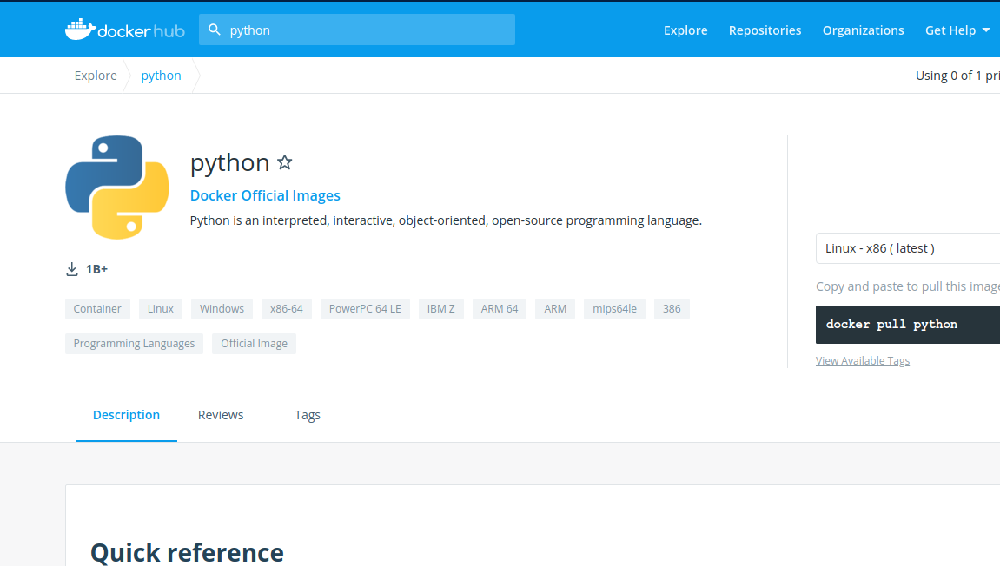

# O que é docker

O docker é uma ferramenta que nos permite criar container para nossas aplicações.

## O que seria um container?

Um container é nada mais do que um processo, e dentro desse processo você terá uma aplicação rodando com todas as suas dependências isoladas do sistema operacional. Pensando assim pode até parecer que o docker é como uma máquina virtual feita no virtual box. Afinal temos ai um sistema que consegue rodar coisas isoladamente dentro do nosso próprio sistema operacional de forma totalmente isolada. Mas não é a mesma coisa. Tem aqui um diagrama da própria documentação para nos ajudar a entender as diferenças.

<h1 align="center">
    <div style="display:flex; flex-direction:row; align-items:center; justify-content:space-between">
        
        
    </div>
</h1>

Pelas imagens, vemos uma certa semelhança entre os dois processos, porém vemos claramente que a diferença é que o docker não precisa subir todo um sistema operacional para cada container, ele utiliza dos recursos de OS da própria OS hospedeiro, enquanto a VM precisa sempre subir todo um sistema operacional e ainda precisa do Hypervisor para fazer a conexão com a infraestrutura da máquina.

A vantagem disso é que uma imagem docker é muito leve. Ela pode ser criada contendo somente o mínimo necessário para rodar a aplicação que deseja, enquanto um VM precisa ter todo um sistema operacional por trás.

Mas como já deve imaginar, se a máquina docker utiliza o sistema host como fonte de recursos, o sistema host pode ser windows, linux ou mac? tanto faz? A resposta é não. O docker foi feito para rodar com sistemas linux, logo seu melhor desempenho é com linux. Porém isso não significa que não de para utilizar ele com outros sistemas, tem como instalar o docker para todas os sistemas.


## O que é uma imagem docker?

Uma imagem docker é nada mais do que resultado de um container montado. Ou seja, uma vez que você criar um container e subir o código necessário para sua aplicação rodar, você pode gerar uma imagem do seu container e utilizá-la depois.

## Mas como criar uma container??

Bom, todo container é feito a partir de uma imagem pré-existente. E se quiser buscar imagens para utilizar, eu recomendo ir no site do [docker hub](https://hub.docker.com/) para isso (na verdade você será obrigado a utilizá-lo). Lá é onde ficam hospedadas as imagens que a comunidade foi criando ao longo do tempo, e é a partir de lá que o docker puxa uma imagem para você instalar na sua máquina.

Lá você vai encontrar imagens do ubuntu, do postgres, mysql, ngix, php, python, ruby... E tudo quanto é coisa que você imaginar.

Mas como eu disse antes, uma imagem sempre é construída em cima de outra, logo quando vemos uma imagem do postgres, provavelmente o que aconteceu foi que quem a criou se baseou em uma imagem de uma máquina ubuntu e então instalou dentro dela o postgres, gerou uma imagem disso e colocou ela no docker hub. E é assim que o processo funciona, você precisa pegar uma imagem que mais se assemelha ao que você deseja utilizar, e então vai adicionando coisas a ela.


## Mas quais as vantagens de se utilizar docker??
Bem, o objetivo pelo qual o docker foi inventado foi para igualar os ambientes de desenvolvimento. Evitando o famoso "mas na minha máquina funciona", afinal agora a imagem docker é uma só entre todo o time, logo não tem nem jeito de alguma coisa acontecer diferente entre máquinas. Afinal com a mesma imagem, sempre teremos as mesmas coisas instaladas e sempre nas mesmas versões, e sempre na mesma base de sistema operacional. Logo não importa se utiliza windows, linux ou mac, o container é sempre o mesmo.

Outra grande vantagem de utilizar uma imagem para desenvolver é que você configura todo seu sistema de desenvolvimento com literalmente um comando (desde que a imagem já esteja pronta). 

E caso queira instalar alguma coisa na sua máquina para ver como funciona, ou trabalhar com essa determinada tecnologia será bem mais simples instalá-la com o docker, afinal é só pegar uma imagem, que já está configurada, e que nem se quer vai realmente estar na sua máquina, afinal o container está isolado. Logo não existe o problema de conflito entre bibliotecas do sistema e de uma aplicação, e nem aquele probleminha chato que a gent passa ao desinstalar alguma coisa que tem um dependência comum com outras aplicações e durante a desinstalação essa dependência é apagada e de repente você está sem interface gráfica (quem nunca fez isso quando começou a fuçar em uma distro linux)


> Para entender o que é docker você também pode buscar diretamente na documentação do mesmo, por esse [link](https://docs.docker.com/get-started/).


# Como instalar essa maravilha

Novamente a documentação está [aqui](https://docs.docker.com/get-docker/) para te ajudar, caso tenha qualquer problema siga a mesma.

A instalação do docker deve ser seguida da instalação do docker-compose, que mais para frente explicarei o que é

## Linux

```shell
sudo apt install docker.io
sudo curl -L "https://github.com/docker/compose/releases/download/1.26.2/docker-compose-$(uname -s)-$(uname -m)" -o /usr/local/bin/docker-compose
sudo chmod +x /usr/local/bin/docker-compose
sudo groupadd docker
sudo usermod -aG docker $USER
su $USER
```

## MAC
aparentemente é só fazer o [download](https://docs.docker.com/docker-for-mac/install/) que está na página do docker e mandar instalar.

## Windows
Na página do docker também temos um [download](https://docs.docker.com/docker-for-windows/install/) disponível em forma de executável, mas necessita algumas configurações de virtualização. Então recomendação pessoal: Não instale o docker para windows normalmente, utilize o WSL para instalar o docker, afinal ele precisará do linux para rodar normalmente, então é melhor instalar o WLS do que tentar utilizar algum tipo de virtualização. Para isso eu recomendo ver esse video [aqui](https://www.youtube.com/watch?v=g4HKttouVxA) que mostra como fazer isso além de dar uma explicação do porque fazer dessa forma.


# Criando um projeto para testarmos o docker
O projeto que irei utilizar será apenas uma rota feita com flask, que está no arquivo `server.py`

```Python
from flask import Flask, jsonify
import os

app = Flask(__name__)


@app.route('/')
def root():
    return 'Hello'


os.environ['FLASK_ENV'] = "development"
app.run(host='0.0.0.0', port=5000)
```



# Criando o container
O container a ser criado, será um container com python na versão 3.

Indo até o docker hub podemos encontrar imagem do python



Para criar a imagem, vou utilizar o `Dockerfile`. Na [documentação](https://docs.docker.com/engine/reference/builder/) você encontra a referência para cada comando do dockerfile 


```dockerfile
FROM python:3.8

WORKDIR /usr/src/app

COPY requirements.txt ./
RUN pip3 install --no-cache-dir -r requirements.txt

COPY . .

EXPOSE 5000

CMD [ "python", "./server.py" ]
```

Explicando o dockerfile

O dockerfile é um arquivo que é a "receita" da nossa imagem. 

Como falei antes, toda imagem precisa vir a partir de outra imagem já pré-existente. Nesse caso, a imagem do python 3.8.

- FROM: Indica a imagem a partir da qual eu quero criar a minha imagem
- WORKDIR: Qual a pasta dentro do container que irei utilizar para colocar minha aplicação
- COPY: Faz a copia de um ou mais arquivos para uma determinada pasta para dentro do container
- RUN: Executa um comando no container
- EXPOSE: Indica qual porta do seu computador se comunicara com qual porta do seu container
- CMD: Executa um comando final no container, é nesse comando que você manda sua aplicação executar

Ou seja, esse dockerfile faz o seguinte: Ele baixa uma imagem do python 3.8, estabelece que iremos trabalhar na pasta /usr/src/app, copia o arquivo requirements.txt para dentro de ./ (nosso workdir) e depois manda o pip instalar as dependências listadas no requirements.txt. Após instalar tudo ele copia o restante dos arquivos para dentro da pasta workdir (o arquivo server.py, a pasta images, readme.md e o proprio dockerfile), logo em seguida ele expõe a porta 5000 do container (o flask roda na porta 5000 por padrão) e depois executa o comando python, passando ./server.py como parâmetro, ou seja, ele roda o comando `python ./server.py`.

O arquivo requirements.txt terá como dependência apenas o flask

```txt
Flask==1.1.2
```

Para executar esse container rode os comandos:

```shell
$ docker build -t flask_img .
$ docker run -p 5000:5000 --name flask_hello flask_img
```

Os comandos indicam que queremos construir uma imagem chamada flask_img a partir de um dockerfile que se encontra dentro da pasta `.` (ou seja, a pasta que estamos no momento), e depois nós efetivamente rodamos o container indicando que quando eu chamar na porta 5000 do meu computador ele ligará com a porta 5000 do conatainer que recebeu o nome de flask_hello.

Se você der o comando `$ docker ps` você verá os containers em execução, e poderá ver nessa lista o container `flask_hello` e se rodar o comando `$ docker images` poderá ver a imagem `flask_img`

> OBS.: Container que não estão em execução, mas que existem, podem ser vistos com o comando `$ docker ps -a` e as imagens com `$ docker images -a`

Agora se formos no navegador, e entrar em `http://localhost:5000` veremos a nossa aplicação rodando.

>OBS: Se quiser dar start no container quando ele não estiver operando, basta rodar o comando `$ docker start nome_do_container`. Para deletar um container `$ docker rm nome_do_container`. para deletar uma imagem `$ docker rmi nome_da_imagem`. Talvez os comandos de deletar precisem do -f na frente para ser forçado.


> OBS.: Uma coisa importante é que você precisa garantir que sua aplicação vai rodar no ip externo do container, ou seja, em 0.0.0.0, pois quando a porta dele é exposta, ela é exposta para esse ip, logo quando você acessar a porta no localhost pela sua máquina ela vai acessar a porta determinada mas no ip externo do container, por isso eu coloquei `app.run(host='0.0.0.0', port=5000)` na minha aplicação.


# Docker compose
O docker compose vai nos ajudar a gerenciar nossos container, isso é bem útil quando queremos montar uma aplicação que precise de vários containers. Como por exemplo, uma aplicação flask e um banco de dados postgres, ai em um determinado momento precisa também de elasticsearch, kibana, nginx, apache. Vai pensando ai...

Imagine subir cada um desses containers na mão, isso daria um trabalho tremendo, sem falar que nesse caso precisaríamos fazer os containers se comunicarem. E sempre que reiniciamos nossa máquina temos que subir eles novamente, e sempre com essas sequências de comandos. Dai vem a ideia do docker compose. Através de um arquivo .yml você consegue fazer todas essas chamadas e configurações ficarem automáticas.
